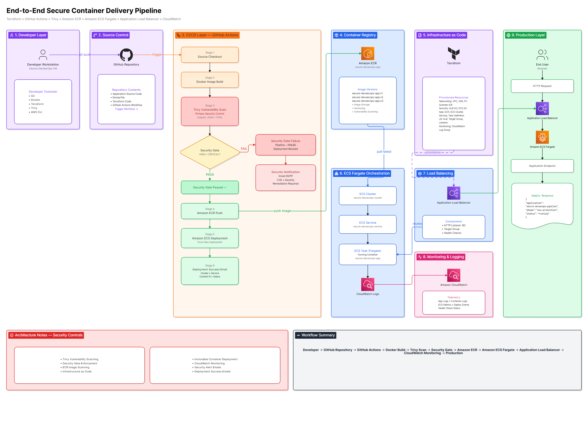

# 🚀 End-to-End Secure Container Delivery Pipeline

> **Enterprise-grade DevSecOps Pipeline built using Terraform, GitHub Actions, Trivy, Amazon ECR, Amazon ECS Fargate, Application Load Balancer, and CloudWatch.**

This project demonstrates how to securely build, scan, store, deploy, and monitor a containerized application on AWS using Infrastructure as Code (Terraform) and a fully automated CI/CD pipeline powered by GitHub Actions.

---

## 📌 Project Overview

Modern software delivery requires more than just deployment automation. Security must be integrated directly into the CI/CD lifecycle to ensure vulnerable container images never reach production.

This project implements a complete **DevSecOps workflow** where:

* Infrastructure is provisioned using Terraform.
* Container images are built automatically.
* Vulnerability scanning is performed using Trivy.
* Security Gates enforce deployment policies.
* Secure images are pushed to Amazon ECR.
* ECS Fargate deployments are triggered automatically.
* Application traffic is routed through an Application Load Balancer.
* Logs and operational visibility are provided by Amazon CloudWatch.
* Deployment and security notifications are sent via email.

---

## 🏗 Architecture Diagram

[](images/architecture-diagram.png)

---

# 🎯 Solution Architecture

```text
Developer
    │
    ▼
GitHub Repository
    │
    ▼
GitHub Actions

    ├── Source Checkout
    ├── Docker Build
    ├── Trivy Scan
    ├── Security Gate
    ├── ECR Push
    ├── ECS Deployment
    └── Deployment Notification

    │
    ▼

Amazon ECR
    │
    ▼

Amazon ECS Fargate
    │
    ▼

Application Load Balancer
    │
    ▼

Production Users

    │
    ▼

Amazon CloudWatch
```

---

# 🛠 Technologies Used

## Cloud Platform

* AWS

## Infrastructure as Code

* Terraform

## CI/CD

* GitHub Actions

## Containerization

* Docker

## Security

* Trivy
* Amazon ECR Image Scanning

## Compute

* Amazon ECS Fargate

## Container Registry

* Amazon ECR

## Load Balancing

* Application Load Balancer (ALB)

## Monitoring

* Amazon CloudWatch

## Notifications

* Gmail SMTP

---

# ☁ AWS Services Used

| Service                   | Purpose                 |
| ------------------------- | ----------------------- |
| Amazon ECR                | Container Registry      |
| Amazon ECS Fargate        | Container Orchestration |
| Application Load Balancer | Traffic Routing         |
| Amazon CloudWatch         | Logs & Monitoring       |
| Amazon VPC                | Network Isolation       |
| Security Groups           | Network Security        |
| Internet Gateway          | Public Connectivity     |
| IAM                       | ECS Execution Role      |

---

# 🏗 Infrastructure Provisioned Using Terraform

## Networking

* VPC
* Internet Gateway
* Route Table
* Public Subnet A
* Public Subnet B

## Security

* ALB Security Group
* ECS Security Group

## Container Services

* Amazon ECR Repository
* ECS Cluster
* ECS Service
* ECS Task Definition

## Load Balancing

* Application Load Balancer
* Target Group
* Listener

## Monitoring

* CloudWatch Log Group

---

# 🔄 CI/CD Workflow

## Stage 1 – Source Checkout

GitHub Actions retrieves the latest source code from the repository.

---

## Stage 2 – Docker Build

The application image is built using Docker.

```bash
docker build -t secure-devsecops-app:v1 ./app
```

---

## Stage 3 – Trivy Vulnerability Scan

Trivy scans the Docker image for vulnerabilities.

Generated Reports:

* JSON Report
* Human Readable Report

Artifacts are uploaded automatically to GitHub Actions.

---

## Stage 4 – Security Gate

The Security Gate evaluates scan results.

Policy:

```text
HIGH Vulnerabilities   → Fail
CRITICAL Vulnerabilities → Fail
```

If vulnerabilities exceed the threshold:

```text
Pipeline Status = FAILED
Deployment Blocked
Email Alert Sent
```

Otherwise:

```text
Pipeline Status = PASSED
Proceed to Deployment
```

---

## Stage 5 – Push to Amazon ECR

Secure container images are pushed to Amazon ECR.

Example:

```text
secure-devsecops-app:v1
```

---

## Stage 6 – ECS Deployment

After a successful push:

```bash
aws ecs update-service \
--cluster secure-devsecops-cluster \
--service secure-devsecops-service \
--force-new-deployment
```

A new deployment is triggered automatically.

---

## Stage 7 – Deployment Success Notification

GitHub Actions sends a deployment confirmation email containing:

* Cluster Name
* Service Name
* Commit ID
* Deployment Status

---

# 🔒 Security Controls

This project incorporates security directly into the delivery pipeline.

## Trivy Vulnerability Scanning

Scans container images for:

* CVEs
* OS Package Vulnerabilities
* Library Vulnerabilities

---

## Security Gate Enforcement

Blocks deployment when:

```text
HIGH vulnerabilities detected
OR
CRITICAL vulnerabilities detected
```

---

## Amazon ECR Image Scanning

ECR performs vulnerability analysis on pushed images.

---

## Immutable Deployments

Containers are rebuilt and redeployed instead of being modified in place.

---

## Email Notifications

Security alerts are generated automatically when:

* Security Gate fails
* Vulnerability threshold is exceeded

---

# 📊 Monitoring & Observability

## Amazon CloudWatch

Container logs are centralized using:

```text
/ecs/secure-devsecops-app
```

Collected telemetry:

* Application Logs
* Container Logs
* ECS Metrics
* Deployment Events
* Health Check Status

---

# 🌐 Production Deployment

Application traffic flows through:

```text
Internet
    │
    ▼
Application Load Balancer
    │
    ▼
Target Group
    │
    ▼
ECS Fargate Task
```

Application Response:

```json
{
  "application": "secure-devsecops-pipeline",
  "phase": "ecs-production",
  "status": "running"
}
```

---

# 🧪 Validation & Testing

## ✅ Docker Build Validation

Successfully built application image using GitHub Actions.

---

## ✅ Trivy Validation

Generated:

* JSON Report
* Text Report

Uploaded as pipeline artifacts.

---

## ✅ Security Gate Validation

Tested both:

### Success Scenario

```text
No HIGH/CRITICAL Vulnerabilities
Deployment Allowed
```

### Failure Scenario

```text
HIGH/CRITICAL Vulnerabilities Found
Deployment Blocked
Email Notification Triggered
```

---

## ✅ Amazon ECR Validation

Verified:

```text
Image Push Successful
Image Tag Available
Image Scan Findings Generated
```

---

## ✅ ECS Validation

Verified:

```text
ECS Service Running
Task Healthy
Desired Count Achieved
```

---

## ✅ ALB Validation

Verified application accessibility through ALB DNS endpoint.

---

## ✅ CloudWatch Validation

Verified:

```text
Log Group Created
Log Stream Generated
Container Logs Visible
```

---

## ✅ Deployment Notification Validation

Verified successful deployment email notifications.

---

# 🚧 Challenges Faced & Resolutions

## Challenge 1 – GitHub Actions YAML Issues

### Problem

ECR Push job was not executing correctly.

### Root Cause

Incorrect YAML indentation and job nesting.

### Resolution

Corrected workflow structure and job dependencies.

---

## Challenge 2 – Security Notification Workflow

### Problem

Notification job was not triggering as expected.

### Resolution

Updated workflow condition:

```yaml
if: always() && needs.security-scan.result == 'failure'
```

---

## Challenge 3 – AWS SES SMTP Testing

### Problem

Received:

```text
501 Invalid MAIL FROM address provided
```

### Resolution

* Verified SES Identity
* Tested using AWS CLI
* Validated SMTP credentials

---

## Challenge 4 – ECS Architecture Design

### Initial Design

```text
Internet
    ▼
ECS Public IP
```

### Final Design

```text
Internet
    ▼
Application Load Balancer
    ▼
ECS Fargate
```

More secure and production-ready.

---

## Challenge 5 – Terraform Subnet Migration

### Problem

Renaming Terraform-managed subnet caused resource replacement risk.

### Resolution

Maintained existing subnet state and added a second subnet separately.

---

## Challenge 6 – Centralized Logging

### Problem

No application-level visibility.

### Resolution

Integrated ECS with CloudWatch Logs using:

```text
awslogs
```

driver configuration.

---

# 📈 Project Outcomes

✔ Fully Automated CI/CD Pipeline

✔ Security Integrated into CI/CD

✔ Automated Vulnerability Scanning

✔ Infrastructure as Code

✔ ECS Fargate Deployment Automation

✔ Application Load Balancer Integration

✔ CloudWatch Monitoring

✔ Deployment Notifications

✔ Enterprise DevSecOps Workflow

---

# 🔮 Future Enhancements

Planned improvements:

* HTTPS using ACM Certificates
* Custom Domain Integration
* AWS WAF
* Secrets Manager Integration
* Multi-Environment Deployment
* Blue/Green Deployments
* OIDC Authentication for GitHub Actions
* Prometheus & Grafana Monitoring
* Automated Compliance Checks
* Slack / Teams Notifications

---

# 👨‍💻 Author

**Karan Singh Rajawat**

DevOps • Cloud • DevSecOps • AWS

GitHub: `https://github.com/karandevops18`

LinkedIn: `https://www.linkedin.com/in/karanrajawat1801/`

---

# ⭐ Key Takeaway

This project demonstrates a complete real-world DevSecOps implementation where security is enforced before deployment, infrastructure is fully automated through Terraform, containerized workloads run on ECS Fargate behind an Application Load Balancer, and operational visibility is achieved through CloudWatch—all integrated into a single automated delivery pipeline. 🚀
